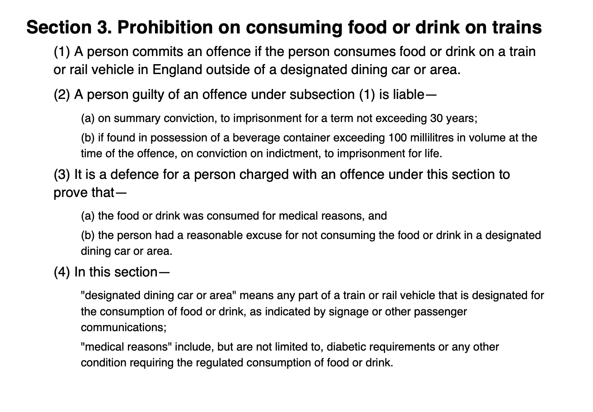

<a>

</a>

# `legis-maker`

<!-- add image to the right in line with text -->
### Instructions: 

1. Create Conda environment 
```
$ conda env create -f environment.yml
```
2. Create .env file in the root directory and add the following line with respective key. 
```
ANTHROPIC_API_KEY=sk-ant-api03-...
```
3. Run `draft_legislation/draft_legislation.py` to generate a piece of legislation, which calls from the specified file (in this case `data/skateboard.txt`).
```
proposed_act_path = "data/skateboard.txt"
create_legislation(proposed_act_path)
```

### Example Output



### Team (Group 29)
- Shahbaz Chaudhry
- Jamie Mann
- Alun Rees
- Kevin Russling
- Tom Savage
- Jess Watson